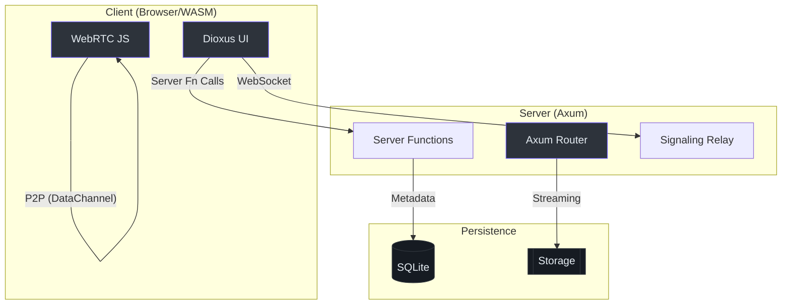

# 🕊️ Hermes

**Hermes** is a privacy-focused, high-performance file-sharing application built with **Rust**, **Dioxus 0.7**, and **Axum**. It prioritizes direct Peer-to-Peer (P2P) transfers via WebRTC while providing a robust server-side upload/download fallback.

---

## 📚 Documentation Index

For detailed guides, please refer to the specialized documentation in the `docs/` folder:

- **🚀 [Onboarding Guide](docs/ONBOARDING.md)**: Setup, project structure, and your first task.
- **🏗️ [Architectural Deep-Dive](docs/ARCH_DEEP_DIVE.md)**: Signaling flow, P2P chunking protocol, and system design.
- **🐳 [Deployment Guide](docs/DEPLOYMENT.md)**: Docker configurations (Standard vs. Standalone) and VPS setup.

---

## 🏗️ Architecture at a Glance

Hermes operates on a hybrid model, balancing the immediacy of P2P with the persistence of server-side storage.



---

## 🧪 Quick Start

```bash
# Install Dioxus CLI
cargo install dioxus-cli --version 0.7.0

# Run in development mode (hot-reload)
dx serve --platform web
```

---

## 🗺️ Roadmap

- [ ] **V2**: FIDO2/WebAuthn Authentication.
- [ ] **V2**: S3-compatible storage backend.
- [ ] **V3**: Full Client-side encryption (E2EE) for server-side uploads.

---

Built with ❤️ using [Dioxus](https://dioxuslabs.com).
