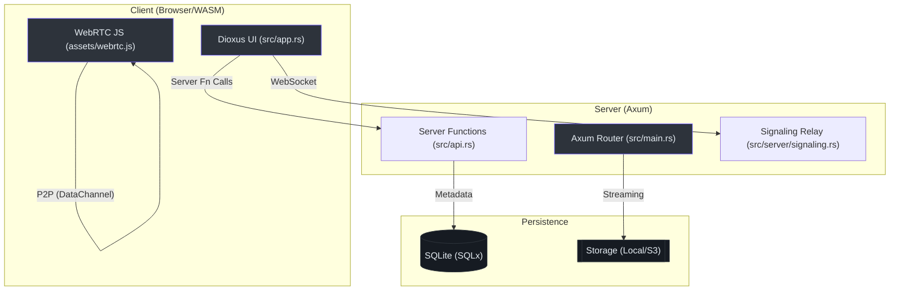

# 🕊️ Hermes

**Hermes** is a privacy-focused, high-performance file-sharing application built with **Rust**, **Dioxus 0.7**, and **Axum**. It prioritizes direct Peer-to-Peer (P2P) transfers via WebRTC while providing a robust server-side upload/download fallback.

---

## 🏗️ Architecture at a Glance

Hermes operates on a hybrid model, balancing the immediacy of P2P with the persistence of server-side storage.



---

## 🚀 Quick Start (Zero-to-Hero)

### Prerequisites
- **Rust Toolchain**: [rustup.rs](https://rustup.rs/)
- **Dioxus CLI**: `cargo install dioxus-cli --version 0.7.0`
- **WASM Target**: `rustup target add wasm32-unknown-unknown`

### Development Mode
```bash
# Runs both frontend (WASM) and backend (Axum) with hot-reload
dx serve --platform web
```
Visit `http://localhost:8080`.

---

## 📡 Core Transfer Methods

### 1. Direct P2P (Privacy-First)
Uses WebRTC DataChannels for direct peer-to-peer transfer. The server only acts as a signaling relay.
- **Protocol**: Custom stop-and-wait chunking (64 KB chunks with ACKs).
- **Security**: Mandatory DTLS encryption.
- **Implementation**: `assets/webrtc.js:15` (Client) and `src/server/signaling.rs:115` (Server).

### 2. Server-Side Persistence (Availability-First)
Standard multipart upload with streaming download support.
- **TTL**: Files are automatically purged after 7 days.
- **Storage**: Abstracted via `StorageBackend` trait `(src/server/storage/mod.rs:10)`.
- **Cleanup**: Background task runs hourly to purge expired files `(src/server/cleanup.rs:88)`.

---

## 📂 Project Navigation

| Module | Purpose | Key File |
| :--- | :--- | :--- |
| **Frontend** | Dioxus components and pages. | `src/pages/home.rs` |
| **Bridge** | Client-to-Server async functions. | `src/api.rs` |
| **Signaling** | WebRTC WebSocket relay logic. | `src/server/signaling.rs` |
| **Storage** | File persistence (Local/Traits). | `src/server/storage/local.rs` |
| **Models** | Shared Serde data structures. | `src/models/file.rs` |

---

## 🐳 Deployment

Hermes is container-ready with two configurations:

1.  **Standard (`Dockerfile`)**: Optimized for Cloud/K8s environments with an external reverse proxy.
2.  **Standalone (`deploy/standalone/Dockerfile`)**: All-in-one image with Nginx, Certbot (SSL), and Supervisord.

For detailed instructions, see the [Deployment Guide](docs/DEPLOYMENT.md).

---

## 🧪 Testing

```bash
# Run all 40+ unit and integration tests
cargo test --features server
```

Key test suites:
- **Storage Persistence**: `tests/storage.rs`
- **P2P Signaling**: `src/server/signaling.rs` (inline tests)
- **Session Lifecycle**: `tests/sessions.rs`

---

## 🗺️ Roadmap & ADRs

Detailed architectural decisions (ADRs) and the deep-dive into P2P reliability can be found in the [Architectural Deep-Dive](docs/ARCH_DEEP_DIVE.md).

- [ ] **V2**: FIDO2/WebAuthn Authentication.
- [ ] **V2**: S3-compatible storage backend.
- [ ] **V3**: Full Client-side encryption (E2EE) for server-side uploads.

---

Built with ❤️ using [Dioxus](https://dioxuslabs.com).
