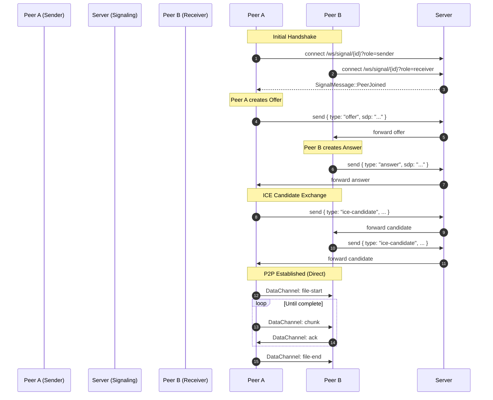
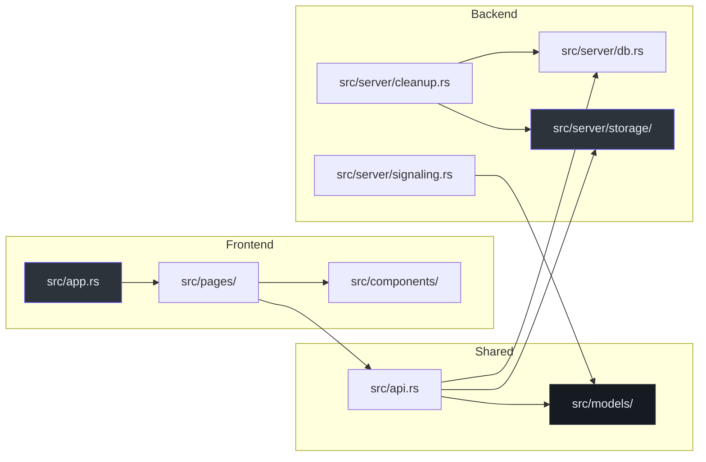

# 🏗️ Hermes Architectural Deep-Dive

Hermes is designed as a hybrid file-sharing platform that balances privacy (P2P) with availability (Server-side storage).

## 🌍 Philosophy: Hybrid Delivery

The system provides two distinct paths for data:
1.  **Persistence Path**: Standard HTTP upload/download with server-side metadata and file storage.
2.  **Privacy Path**: Direct P2P transfer using WebRTC DataChannels where the server only acts as a signaling relay.

## 📡 WebRTC Signaling & Transfer

The P2P implementation avoids complex TURN/STUN management on the server by delegating all WebRTC logic to the client-side `webrtc.js`.

### 1. Signaling Relay (Server-side)
The `SignalingRegistry` `(src/server/signaling.rs:44)` manages in-memory sessions identified by a `Uuid`.

> **ADR (Architecture Decision Record)**: **In-Memory Signaling**.
> - **Context**: We need to coordinate two peers (Sender and Receiver).
> - **Decision**: Use a `HashMap` protected by a `Mutex` in a shared `Arc`.
> - **Trade-offs**: Simple to implement, but sessions are lost on server restart. Given sessions only last for the duration of a transfer, this is acceptable.

### 2. Custom Chunking Protocol
To ensure reliability over WebRTC (which can have UDP-like characteristics if not configured properly), Hermes implements a **stop-and-wait** mechanism.

> **Code Citation**: `(assets/webrtc.js:15)`
> ```javascript
> // Protocol (over DataChannel):
> // Sender → Receiver: { type: "file-start", ... }, { type: "chunk", index, data }
> // Receiver → Sender: { type: "ack", index }
> ```

### Sequence: P2P Connection Establishment



## 🗄️ Storage Engine abstraction

Hermes abstracts the storage via the `StorageBackend` trait `(src/server/storage/mod.rs:10)`.

```rust
#[async_trait]
pub trait StorageBackend: Send + Sync {
    async fn put(&self, key: &str, data: Bytes) -> anyhow::Result<()>;
    async fn get(&self, key: &str) -> anyhow::Result<Bytes>;
    async fn delete(&self, key: &str) -> anyhow::Result<()>;
}
```

The default implementation uses `LocalStorage` `(src/server/storage/local.rs:15)`, but the abstraction allows swapping for S3 or other cloud providers without changing the core logic in `upload_handler` `(src/server/upload.rs:35)`.

## 🧹 Housekeeping: The Cleanup Task

The server spawns a background task `(src/server/cleanup.rs:88)` that runs hourly. It performs a "Double Delete":
1.  **Storage**: Deletes the physical file from the backend.
2.  **Database**: Deletes the metadata row from the SQLite `files` table.

> **Failure Mode**: If storage deletion fails, the DB record is **not** deleted, ensuring a retry in the next cycle `(src/server/cleanup.rs:48)`.

---

## 🛠️ System Component Map


