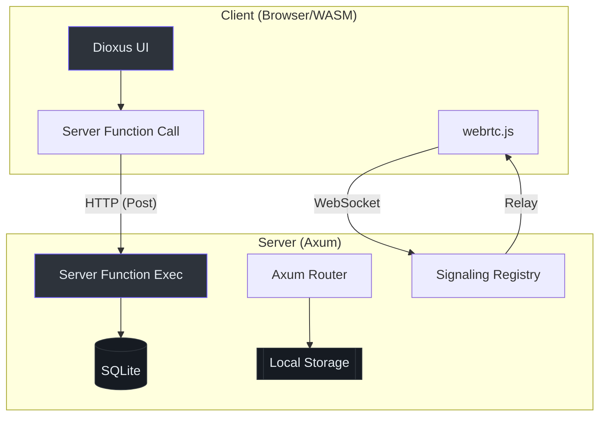

# 🚀 Hermes Zero-to-Hero Guide

Welcome to **Hermes**, a high-performance, fullstack file-sharing application built with **Rust**, **Dioxus 0.7**, and **Axum**.

## 🛠️ Environment Setup

### Prerequisites
1.  **Rust Toolchain**: Install via [rustup](https://rustup.rs/).
2.  **Dioxus CLI**:
    ```bash
    cargo install dioxus-cli --version 0.7.0
    ```
3.  **WASM Target**:
    ```bash
    rustup target add wasm32-unknown-unknown
    ```

### Running the Project
For development with hot-reloading (frontend and backend):
```bash
dx serve --platform web
```
The app will be available at `http://localhost:8080`.

## 📂 Project Structure

```text
hermes/
├── assets/              # Static assets and JS helpers (WebRTC logic)
├── migrations/          # SQLite schema (SQLx)
├── src/
│   ├── api.rs           # Dioxus Server Functions (The Bridge)
│   ├── app.rs           # Main UI entry point and Routing
│   ├── components/      # Reusable UI components
│   ├── models/          # Shared Data Structures (Serde)
│   ├── pages/           # Application views (Home, Download, etc.)
│   └── server/          # Exclusive server-side logic (DB, Storage)
└── tests/               # Integration and Unit tests
```

## 🧩 Key Concepts

### 1. Server Functions (`src/api.rs`)
Hermes uses Dioxus Server Functions to bridge the client and server. These functions look like normal async functions but run on the server when called from the client.

> **Code Citation**: `(src/api.rs:25)` - `get_file_info` retrieves metadata from SQLite.

### 2. Hybrid Transfer Model
- **Standard**: Files are POSTed to `/api/upload` `(src/server/upload.rs:35)` and stored in `storage/uploads`.
- **P2P**: Uses WebRTC DataChannels for direct transfer, coordinated via WebSockets `(src/server/signaling.rs:115)`.

## 🧪 First Task: Add a "Ping" Server Function

To get familiar with the "Bridge", try adding a simple server function:

1.  Open `src/api.rs`.
2.  Add the following code:
    ```rust
    #[server]
    pub async fn ping_server() -> Result<String, ServerFnError> {
        Ok("Pong from the server!".to_string())
    }
    ```
3.  Call it from a component in `src/pages/home.rs` using `use_resource`.

## 📖 Glossary

| Term | Definition |
| :--- | :--- |
| **Signaling** | The process of exchanging connection metadata (SDP/ICE) to establish a P2P link. |
| **SDP** | Session Description Protocol; describes peer capabilities. |
| **ICE Candidate** | A potential network path (IP/Port) for a P2P connection. |
| **Fullstack Router** | Dioxus feature that handles both client-side SPA routing and server-side SSR/API. |

---

## 🧭 Architecture Overview


